<!-- README.md is generated from README.Rmd. Please edit that file -->

```{r, include = FALSE}
knitr::opts_chunk$set(
  collapse = TRUE,
  comment = "#>",
  fig.path = "man/figures/README-",
  out.width = "100%"
)
```


This documentation gives an illustration of how to use the `PFSMC` R package to detect change points in data generating process based on an update rule and sequential Monte-Carlo algorithm [see @ding2018asymptotically]. Our goal is to achieve an asymptotic oracle score instead of false alarm or location accuracy. In this package, we focus on dealing with online data that comes sequentially with abrupt changes in their underlying distribution. We will first introduce the motivation of developing the underlying algorithms and illustrate how the prediction process works. Then we will show how to install the package from github and do related simulations. At last we will demonstrate several examples using the embeded functions.

# Introduction


Large datasets may vary in their underlying data generating process, that is what we define as changepoints. Changepoint detection is the task of detecting those changes according to observed datasets. Roughly we can categorize detection method into two branches: online detection and offline detection. Difference comes from the way data are observed. Our package is basded on online method, where data comes sequentiall and we detect changepoints as soon as they occur in a real-time setting.

There are also different kinds of change points, which can be divided into abrupt changes and smooth changes. Abrupt changes refer to sharp change in underlying models, while smooth changes refer to slowly changed densities. When changepoints occur as a function of time, that is, when data have time-varying underlying densities, traditional online or offline methods may be less effective to be applied. That motivate us to figure out a more efficient solution.


```{r echo=FALSE, fig.align='center', fig.cap="Different Change Points", fig.pos='!h', fig.show='hold', message=FALSE, warning=F,out.width='60%'}
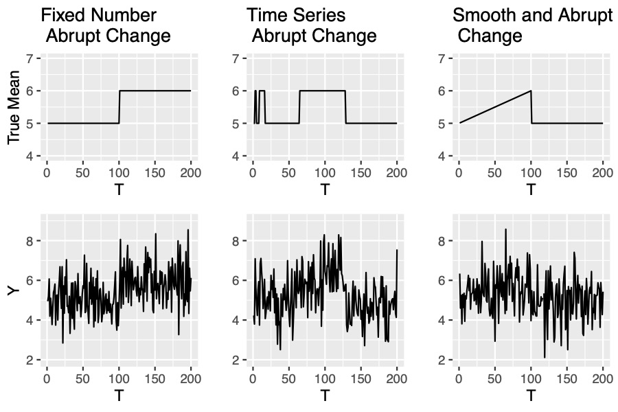
```

# Problems Solution: Prediction Rule

To solve this problem, we implement a concept of "$\epsilon$-net", which is applicable both for parametric models and non-parametric models. We choose an appropriate  $\epsilon$-net for the model class $\{g_t^*\subset\mathcal{G},t=1,...,T\}$ and obtain $N$ function bases $\{g_1^{(\epsilon)},...,g_N^{(\epsilon)}\}$. We first assign each samples equal weights of $\frac{1}{N}$. When receiving new observations, we update the weights according to a score function. 
That requires us to find an appropriate metric to evaluate the detection method's performance. Here, we utilize a score function which relates to the observations. We predict the density of parameter flow at time t based on the observations of $Y_1,...,Y_{t-1}$ and denote the predicted density at time t as $\hat{f}_t$. We then specify a scoring function $s:\mathcal{G}\times\mathcal{Y} \rightarrow \mathbb{R}$ where $\mathcal{G}$ is the model class of $g_t$ and $\mathcal{Y}$ is the range of $Y_t$. A common practice is to use the logarithmic scoring rule $s(g,y)=-\log g(y)$ which is a strictly proper scoring [see @bickel2010scoring]. That is, for any predicted density $\hat{g}_t$, $\int_\mathcal{Y} s(g,y)g^*(y)\geq s(g^*,y)g^*(y)$ and the equation is satisfied only when $g=g^*$.

## Scoring Rule
For Gaussian data, the logarithm scoring function $s(\theta,y)$ is equal to $(\theta-y)^2/2$. We create `loss` function to realize the score function where `theta` denotes samples and `y` is the data point.

```{r}
loss=function(theta,y) {
  return((theta-y)^2/2)
}
```


## Parametric Model Class

When problems are restricted within parameter model class, we can extend the prediction rule to parameter space. When $\epsilon$ is limited to infinity, we can get continuous sample space. 

We first clarify some notations for parameter space. Denote $|\Theta|$ as the Lebesgue measure for parameter space $\{\Theta=\Theta_1\times,...,\times\Theta_n,\Theta\subseteq\mathbb{R}^n\}$. In particular, each $\Theta_j$ is a one-dimensional closed interval with the maximum value $\overline\theta_j\in\Theta_j$ as upper bound and the minimum value $\underline\theta_j\in\Theta_j$ as lower bound. Taken together, we get $|\Theta_j|=(\overline{\theta}_j-\underline{\theta}_j)$ and $|\Theta|=\prod_{j=1}^n|\Theta_j|.$

We add learning parameter $\eta$ and use the exponential loss $\exp\{-\eta s(\theta,y)\}$ to estimate the predictive distribution distribution $p_t(\theta)$. 


Then we begin to set up the algorithm with continuous parameter space. We add the learning parameter $\eta$ to assign weights of next time step samples. After observing new data $y_t$ we obtain that $\tilde{f}_t(\theta)=f_{t-1}(\theta)\cdot \exp\{-\eta s(\theta,y_t)\}$. We dervive the `exploss` function, since now what we want to calculate is the exponential loss. Same as before, `theta` is the parameter flow and `y` is the corresponding data sequence.

```{r}
exploss = function(theta,y,mode=1,eta=1) {
  #mode = 1: first specify loss function then exp it
  #mode = 0: directly calculate the "likelihood"
  if(mode==1) {
    el=exp(-eta*loss(theta,y));
    } else {
      el=dnorm(y,theta,1);
  }
  return(el)
}
```

The weighted elements will better track abrupt changes since neighborhood elements gain similar scores. Here we use the logarithmic scoring rule that is mentioned above. Mixing parameter $\alpha$ is added to mix the updated samples and the normalizing constants $Z_\pi$. The form is derived as $(1-\alpha)\tilde{g}_t(\theta)+\alpha\frac{\int_{\Theta} \tilde{g}_t(\tilde{\theta})d\tilde{\theta}}{|\Theta|}$. We integrate the form into the `transition` function, where `theta` denotes the samples and `alpha` is a given mixing rate.


```{r}
transition=function(theta,alpha) {
  n=length(theta) 
  u=runif(n)
  u=as.numeric(u<=(1-alpha))
  theta_new=theta*u+(a+(b-a)*runif(n))*(1-u)
  return(theta_new)
}
```
 

Learning parameter $\eta$ and mixing parameter $\alpha$ give a "tempering" effect on the weight updating, offering more tolerance/flexibility for potential underlying changes, while producing different rates of convergence. In the mixing step, we redistribute the belief for the values of parameters, which also make it more quickly to detect changes.


<!-- After drawing samples from a Markov kernel, we start to move them according to the transition kernel $K(\cdot|\theta^i_{t+1})\triangleq(1-\alpha)\delta(\cdot)+\alpha/|\Theta|$ specified in step 11 of algorithm 1. With probability $1-\alpha$, let $\theta^i_{t+1}=\theta^i_{t+1}$; with probability $\alpha$, let $\theta^i_{t+1}\sim\text{Unif}(\Theta)$ for $i\in\{1,...,N\}$. `alpha` is our chosen mixing parameter, given by $\alpha_{\text{optimal}=\frac{M_T-1}{T-1}}$.   -->


# Sequetial Monte Carlo Implemented

When calculating the predictive distribution, we use integral to estimate the predictive parameter instead of discretizing model space. That increases the computational cost and has some difficulty in parctical applicaiton. This brings us about using Monte Carlo methods to better sampling from the predicted distributions [see @brooks2011handbook]. We see the mixing process as a state space trasition and use an MCMC kernel to move the particles. 


The metric can be simplified as three steps:

1. Update the weights based on exp$(-\eta s(\cdot,y_t))$;
2. Resample the particles according to their weights;
3. Move the particles using the transition kernel $K(\cdot,\cdot)$.

`Step 1` assigns different weights to the generated samples from an appropriate proposal distribution, while the weights can correct the sample in order to approximate the predictive distribution. `Step 2` turns weighted particles to unweighted ones and make highly weighted samples more easily to be selected. `Step 3` creates a Markov chain $(\Theta^t)_{t\geq1}$ with a MCMC kernel aiming to improve the diversity among the samples. We will first introduce the applied algorithms and then illustrate in the pseudo code.

## Metropolis-Hastings algorithm


<!-- Metropolis-Hasting type is used to generate a Markov Chain $(\Theta_t)_{t\geq1}$ with a transition kernel $K$. At each time t, a candidate $\Theta^*$ is accepted as the new state of the chain with probability $\alpha$ or the chain stays at the last state $\Theta^{t-1}$. The moving step increases samples diversity by changing their locations which helps a lot in converging rates when change occurs. -->

Consider a setting that $\pi_u(\theta)$ in the mixing step can be point-wise evaluated. A popular approach is to generate a Markov chain $\{\bar{{\theta_t}}\}$to approximate the integral $\pi_u(\theta)$. In some sense, $$\int_\Theta \tilde{g}_t(\bar{\theta})K(\theta|\bar{\theta})d\bar{\theta}\xrightarrow [T\rightarrow\infty]{} (1-\alpha)\tilde{g}_t(\theta)+\alpha\frac{\int_{\Theta} \tilde{g}_t(\tilde{\theta})d\tilde{\theta}}{|\Theta|}$$, where $K(\theta|\bar{\theta})$ is an MCMC kernel. In purpose of generating a Markov chain, we can use Metropolis-Hastings algorithm. 


We denote by $q$ a proposal distribution on $\Theta$ which we will go into detail in *Sequential Monte Carlo for Kinetic Prediction* section. We first sample $\theta^*$ from $q(d\theta^*|\theta_{t-1})$. With some probability $\alpha$ the samples move to $\theta^*$, otherwise they just stay at current state. The algorithm is shown as follows.

-----

Starting from an arbitrary $\Theta^1$, iterate for $t=2,3,...$

1. Sample $\Theta^*\sim q(d\theta^*|\Theta^{t-1} )$, where q is a proposal distribution.

2. Compute
$$\alpha(\Theta^*|\Theta^{t-1})=\min\left(1,\frac{\pi(\Theta^*)q(\Theta^{t-1}|\Theta^*)}{\pi(\Theta^{t-1})q(\Theta^*|\Theta^{t-1})}\right).$$

3. With probability $\alpha(\Theta^*|\Theta^{t-1})$, set $\Theta^t=\Theta^*$; otherwise $\Theta^t=\Theta^{t-1}$. 


-----


We use the `MH_move` function to generate the Markov Chain mentioned. We choose $q\sim\mathcal{N}(\hat{\mu}_k^N,\hat{\Sigma}_k^N)$ as our proposal distribution where $\hat{\mu}_k^N$ is the sample mean and $\hat{\Sigma}_k^N)$ is the sample variance from previously retrieved unweighted samples. We denote the parameters as `prop_mean` and `prop_sig`. We set `theta` as current samples and `targrtdist` as the approximated result from preceding filtering distribution. Finally, we get the required Markov Chain `theta_new` from `MH_move`.

```{r}
MH_move=function(theta,targetdist,prop_mean,prop_sig) {
  siz=length(theta)
  theta_new=rnorm(siz,prop_mean,prop_sig) #Generate samples from proposal distribution
  a1=targetdist(theta_new)/targetdist(theta) 
  a2=dnorm(theta,prop_mean,prop_sig)/dnorm(theta_new,prop_mean,prop_sig)
  a=a2*a1 
  #Accept the new candidate with probability min(1,a); otherwise just stay at the previous state.
  accept=rep(0,length(a)) 
  for (i in 1:length(a)) {
    accept[i]=min(1,a[i]) #alpha = min(1,a)
  }
  u=runif(siz) #The probability of accepting the new candidate
  u=as.numeric(u<accept)
  theta_new=theta_new*u+theta*(1-u)
  return(theta_new) #Return the Markov chain.
}
```

## Multinomial Resampling

To prevent the samples to be too concentrated, we add a resampling step after updating the weights. Significant samples gain larger weights and thus have more chance to be selected. Samples degeneracy results from this step can be shown in the Effective Sample Size. ESS was derived from the estimators' variance and can be simplified as $ESS=\frac{1}{\sum_{i-1}^N(W_i)^2}$ with $W_i$ as sample weight.  ESS drops rapidly as observations arrive in algorithm 1. We can solve the issue by resampling tricks when ESS falls below a threshold. A common practice is using multinomial resampling, which will be displayed next.
We choose multinomial resampling algorithm to draw unweighted sample $\bar{\Theta}^{1:N}$ out of the weighted sample $(W^i,\Theta^i)_{i=1}^N$ to approximate the target distribution. The resampling process is described in the following algorithm. 


-----

1. Draw an "ancestry vector" $A^{1:N}\in \{1,...,N\}^N$ independently from a categorical distribution:
$$\forall i\in\{1,...,N\},\forall k\in\{1,...,N\},P(A^i=k)=W^k $$
2. Define $\bar{\Theta^i}$ to be $\Theta^{A_i}$ for all $i\in\{1,...,N\}$.
3. Return $\bar{\Theta}^{1:N}$.

 
-----

Each sample $\Theta^i$ is an ancestor of several offspring which is proportional to the sample weight $W^i$. This is exactly the rule of multinomial distribution: $\Theta^{A_i}\sim \mathcal{M}\text{ult}(N;W^1,...,W^N)$. Sample with higher weight tends to appear more frequently in the unweighted sample set. 
We realize the algorithm through `resampleMultinomial` function. It inputs samples' weights `weight` and returns the index of samples that are selected. We replace the original samples with selected samples.

```{r}
resampleMultinomial=function(weight) {
  M=length(weight) 
  Q=cumsum(weight)
  Q[M]=1
  indx=rep(0,M) #store sample index
  i=1
  while (i<=M) { 
    sampl=runif(1)
    j=1;
  #Resample according to sample weights
  while(Q[j]<sampl) {
    j=j+1
    }
  indx[i]=j
  i=i+1
  } 
  return(indx)
}
```

## Sequential Monte Carlo Particle Filter

Based on the four algorithms above, we come up with the sequential Monte Carlo sampler for kinetic prediction as data comes sequentially[see @ding2018asymptotically]. To initialize, we sample from a uniform distribution with a compact parameter space $\Theta$ and use equal weights as $N^{-1}$. After observing newly comes observation, we update the weights based on Bayesian rule using a logarithm score and transform them to a normalized format. Step 5 computes some useful constants which will be explained later. Step 8-12 is the $\textit{resample-move}$ step. We first compute the effective sample size which is inverse of the sum of squared weights. When ESS is smaller then a give threshold, generally half of the sample size, we start our $\textit{resample-move}$ process. In step 9, we use multinomial distribution to obtain equally weighted samples and then use MH type to move samples according to an MCMC kernel. At last, we mix those resampled samples with a transition kernel $K(\cdot|\theta_{t+1}^i) \triangleq(1-\alpha)\delta(\cdot)+\frac{\alpha}{|\Theta|}$ to gain more sample diversity. 

-----------------------------


Input: Compact parameter space $\Theta\subseteq\mathbb{R}$, data $\{y_t,t=1,...,T\}$ observed sequentially, learning parameter $\eta>0$, mixing parameter $\alpha\in(0,1)$, number of particles $N$, and ESS thershold $c\in[0,1]$.

1. Initialization: sample $\theta_1^i$ independently from Unif$(\Theta)$, and let $W_1^i=N^{-1}$, for all $i=1,...N$.

for $t=1\rightarrow T$ do

2. Use the weighted samples $(W_t^i,\theta_t^i)_{i=1}^N$ to approximate the predictive distribution $p_t(\theta)$;


`Update the Weights:`

3. After receiving new observation $y_t$, calculate given score function $s(\theta_t^i,y_t)$;

4. Update weight $w_t^i=W_t^i\cdot \exp\{-\eta s(\theta_t^i,y_t)\}$;

5. Calculate $\tilde{Z}_t=\sum_{i=1}^Nw_t^i$, $\hat{Z}_t=\prod_{\tau=1}^t \tilde{Z}_{\tau}$, which will be used in the rejuvenate step;

6. Normalize $W_{t+1}^i=\frac{w_t^i}{\sum_{i=1}^N w_t^i}$. Note that $(W_{t+1}^i,\theta_t^i)_{i=1}^N$ approximates the density $\frac{\tilde{f}_t(\theta)}{\int_{\Theta}\tilde{f}_t ({\tilde{\theta}})d\tilde{\theta}}$;


`Resample when ESS falling too low:`

7. Calculate $ESS=\frac{1}{\sum_{i=1}^N(W_t^i)^2}$;

if $ESS<cN$ do

8. Resample $(W_{t+1}^i,\theta_t^i)_{i=1}^N$ to obtain equally weighted samples $(W_{t+1}^i=\frac{1}{N},\theta_t^i)_{i=1}^N$;

`Rejuvenate/Move: `

9. Draw $\theta_{t+1}^i\sim K'(\cdot|\bar{\theta}_t^i)$ using Metropolis-Hastings algorithm, where $K'$ is an MCMC kernel targeting at the density $\frac{\tilde{f}_t(\theta)}{\int_{\Theta}\tilde{f}_t ({\tilde{\theta}})d\tilde{\theta}}$. 

else

10. $W_{t+1}^i=W_{t+1}^i$, $\theta_{t+1}^i=\theta_t^i$;

end if

11. Move $\theta^i_{t+1}$ according to the transition kernel $K(\cdot|\theta_{t+1}^i) \triangleq(1-\alpha)\delta(\cdot)+\frac{\alpha}{|\Theta|}$;

end for


--------------------------------


# R Implementation

Based on existing codes, we wrap up an R package for usage convenince. We can install the package from Github through a single line of code.


```{r echo=TRUE,eval=FALSE}
devtools::install_github("azure10h/PFSMC")
library(PFSMC)
```


## Function Call Graph

We have demonstrated some internal functions in previous sections. Now we display a function call graph of `PFSMC`. Left plot shows how the functions call each other and right plot shows the input and output of each function.

```{r echo=FALSE, fig.align='center', fig.cap="Function Call Graph", fig.pos='!h', fig.show='hold', message=FALSE, warning=F,out.width='50%'}
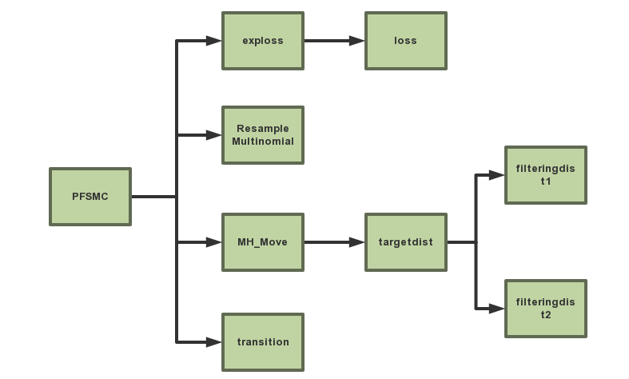
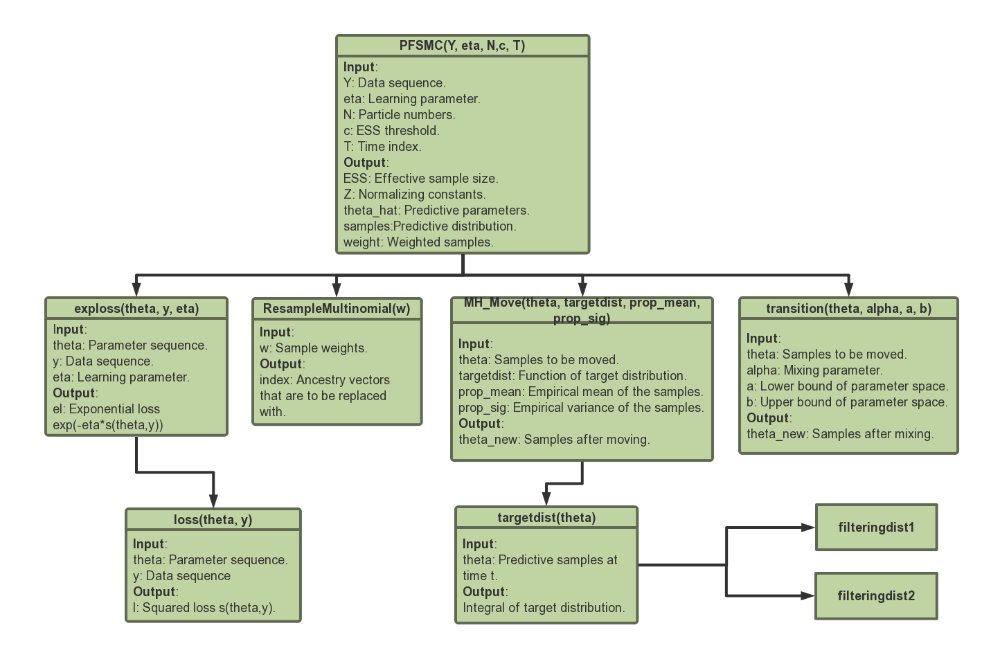
```


## Implementation of PFSMC function


In `PFSMC` package, we have two functions: `PFSMC` and `resampleMultinomial`. `PFSMC` is an implementation of the Sequential Monte Carlo Partical Filter and `resampleMultinomial` is a resampling method that turns weighted samples to unweighted samples. 

We start with initializing samples and weights to realize our algorithm. We sample $\theta_1^i\sim \text{Unif}(-10,10)$ and compute the weights $W_1^i=N^{-1}$ for $i\in\{1,...,N\}$. Here, the uniform distribution is a proposal distribution which is easy to sample from. We specify time index `T` as 201 and particle numbers `N` as 1000. 

```{r}
a=-10;b=10;N=1000;T=200 #Setting parameter space as (-10,10); particle numners N=1000; time=200
tha_sample=-a+(b-a)*runif(1000) #Initial particles theta_1^i for i=1:N
weight=matrix(0,T,N) #Store weights at each time
weight[1,]=rep(1,N)/N #Initial weights W_1^i=1/N
```

In the mixing step, one hard task is to calculate the integral of the targeting distribution $\tilde{f}_t(\theta)$. It is proved that we can estimate the integral as a normalizing constant $\hat{Z}_t$ in step 5. That is, $\hat{Z}_t\stackrel{N\rightarrow\infty}{\longrightarrow}\int_{\Theta}\tilde{f}_t(\tilde{\theta})$. Effective sample size is a criterion to decide the trigger of resampling process while `resample` is a flag of resampling. When `ESS` falling too low, we need to construct unweighted samples. We also create `theta_hat` to store our future predicted parameters for evaluating the predictive metric.


```{r}
Z=rep(0,T) #Normalizing constants denoted in step 5
Z[1]=1 #Sum of weights is equal to 1 with equal weights
ESS=rep(0,T) #Store effctive sample sizes
ESS[1]=N #Initial effective sample size N
resample=numeric(T) #Store resample flags
theta_hat=numeric(T) #Store predicted parameters
```

### Generating the True Parameters and Data Sequence

We create a function called `datagenNoml` to create the true parameters and data sequence where `T` is the time series, `k` is the number of abrupt changes, `a` and `b` are the parameter space. We first generate a parmeter flow with `k` abrupt changes and then sample data points from the normal distribution with changing means and unit variance, that is, $Y_t\sim N(\theta_t,1)$

```{r}
datagenNoml = function(T,k,a,b,sig=1) { 
  if(k==0) {
    theta_true=(a+(b-a)*runif(1))*rep(1,T)
    Y=rnorm(T,theta_true,sig*rep(1,T))
  }
  #determine the chage point randomly
  change_point=floor(T/(k+1))*c(1:k)
  change_point=c(1,change_point,T)
  theta_list=a+(b-a)*runif(k+1)
  theta_true=rep(0,T)
  #Generate the true parameter
  for(j in 1:(k+1)) {
    theta_true[change_point[j]:change_point[j+1]]=theta_list[j]
  }
  #Generate data
  Y=rnorm(T,theta_true,sig*rep(1,T))
  return(list(Y,theta_true))
}
```

In this case, we choose $k=5$, $T=200$, $a=-10$ and $b=10$. We run the function and get the normal data sequence as the plot displays. The red straight line is the true mean and the light blue line is the data sequence. 

```{r echo=FALSE, fig.align='center', fig.cap="Different Change Points", fig.pos='!h', fig.show='hold', message=FALSE, warning=F,out.width='50%'}
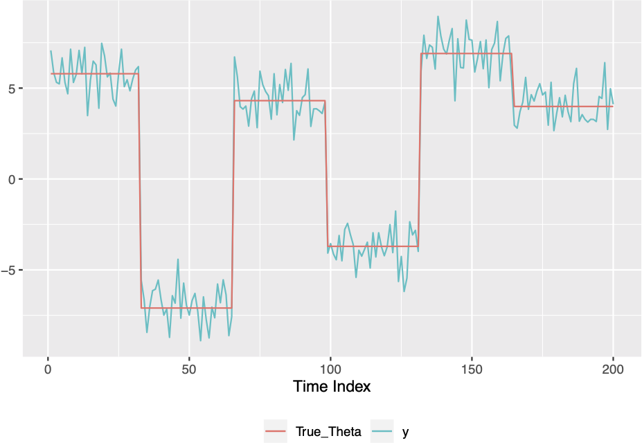
#knitr::include_graphics("call2.jpg")
```

Now we start to use the function `PFSMC` to detect change points. We use previously generated normal data sequence Y as `Y`. We then specify learning parameter `eta` as 0.1, particle numbers `N` as 1000, ESS threshold `c` as 0.5, time index `T` as 200. For mixing parameter `alpha`, we choose the value `(k-1)/(T-1)` which equals to 0.025.

```{r fig.keep='none', message=FALSE, warning=FALSE,eval=FALSE}
library(PFSMC)
set.seed(0421)
a=-10;b=10 #Parameter space
Data=datagenNoml(T,k,a,b) 
Y=Data[[1]] #Data sequence
theta_true=Data[[2]] #True theta
Simulation<-PFSMC(Y=Y,eta=0.1,alpha=0.025,N=1000,c=0.5,T) 
samples=Simulation$samples #Predictive distributions
```


```{r  echo=FALSE, fig.align='center', fig.cap="Different Change Points", fig.pos='!h', fig.show='hold', message=FALSE, warning=F,out.width='30%'}
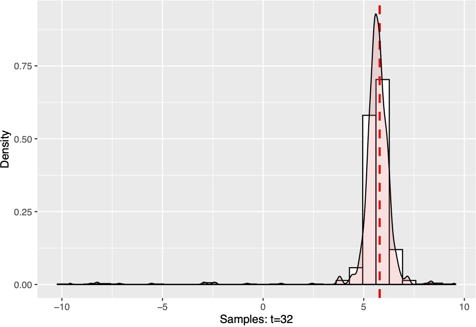
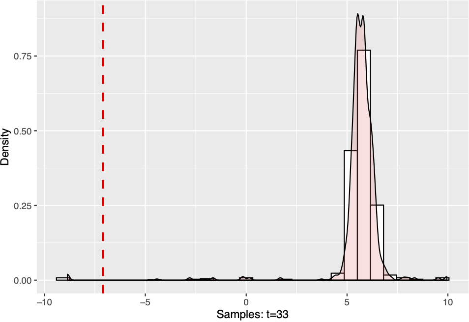
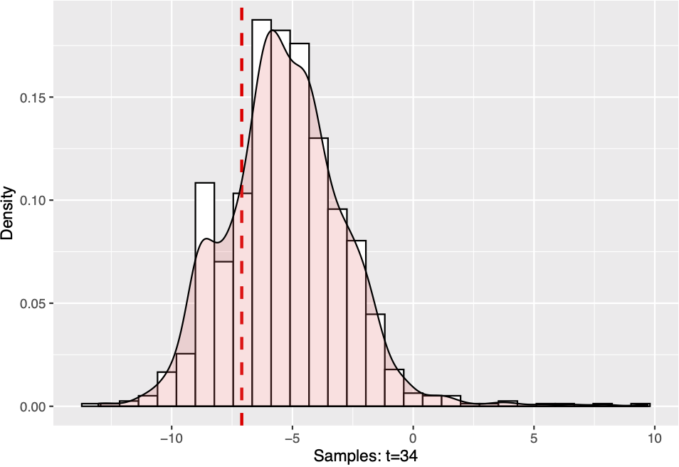
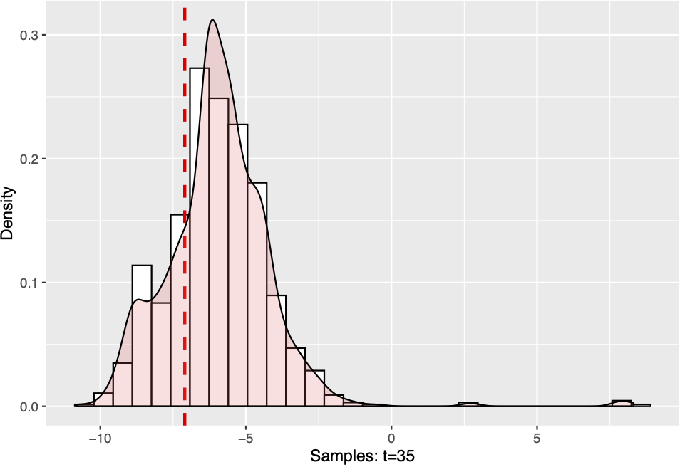
#knitr::include_graphics("call2.jpg")
```

We plot the predictive distribution around time `T=33` which is a change point. The model has an excellent ability to detect change and samples move quickly when change occurs.


### Effecitve Sample Size 

```{r,fig.keep='none',eval=FALSE}
ESS=Simulation[[1]] #Output: efective sample sizes.
Z=Simulation[[2]] #Output: normalizing constants.
theta_hat=Simulation[[3]] #Output: predictive parameters.
resampleflags=Simulation[[4]] #Output: resample flags.
plot(ESS,type = 'l',main = 'ESS',xlab = 'Time Index t')
abline(h=500,col='red',lwd=2)
```

```{r echo=FALSE, fig.align='center', fig.cap="Different Change Points", fig.pos='!h', fig.show='hold', message=FALSE, warning=F,out.width='55%'}
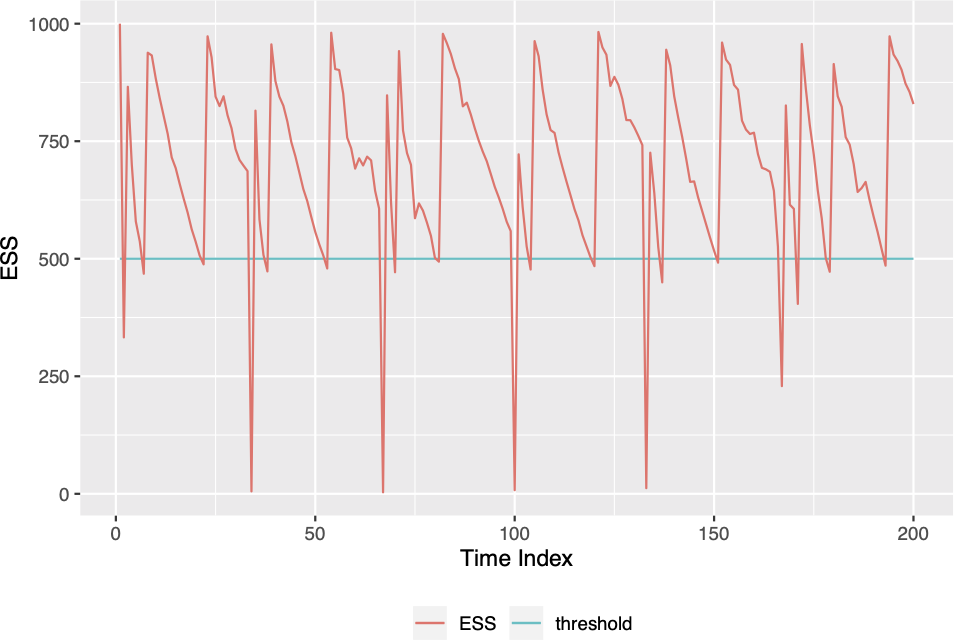
```

From the ESS plot we can see that once the effective sample size falls below the threshold $c*N$, the resampling and move step is triggered immediately to increase it. 

### Predictive Mean

```{r fig.keep="none",eval=FALSE}
plot(Y,type = "l",col="lightblue",axes=F,ylab="",xlab="")
par(new=T)
plot(data.frame(x=1:201,y=theta_true),type='l',col='red',ylim=c(a,b),
     ylab='Data sequence/True mean/Predictive mean',xlab='time index')
title(main="Normal Data Sequence")
par(new=T)
plot(data.frame(x=1:201,y=theta_hat),type='l',col='blue',ylim=c(a,b),
     ylab='',xlab='',axes=F)
ws=numeric(201)
for (i in 1:201){ws[i]=Simulation$samples[i,]%*%Simulation$weight[i,]}
par(new=T)
plot(data.frame(x=1:201,y=ws),type='l',col='green',
     ylim=c(-10,10),ylab='',xlab='',axes=F)
legend("bottomright",legend = c("Data","True mean","Predictive mean","Weighted mean"),lty=c(1,1,1),
       col=c("lightblue","blue","red","green"),cex = 0.5)
```

```{r echo=FALSE, fig.align='center', fig.cap="Different Change Points", fig.pos='!h', fig.show='hold', message=FALSE, warning=F,out.width='40%'}
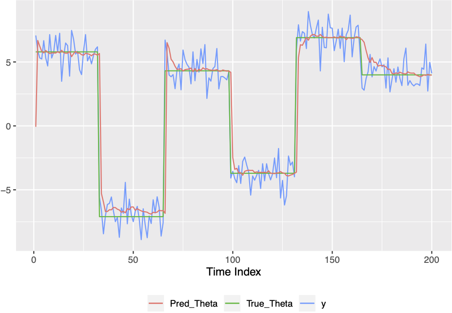
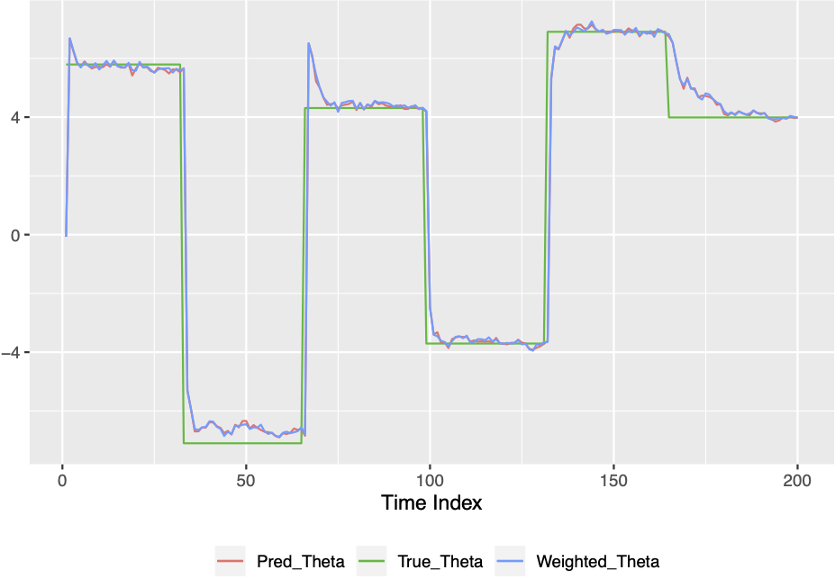

```
Here we use the mean of the samples as predictive mean. It is shown that the model is good fitted and sensitive to changes. We also compute the weighted mean as an alternative. The second plot displays that most part of these two means are overlapped and there is no much difference between them. 


# Reference
