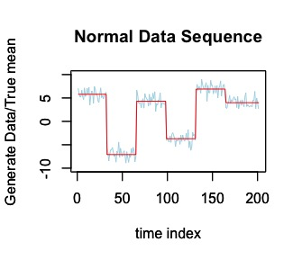

<!-- README.md is generated from README.Rmd. Please edit that file -->
PFSMC
=====

This documentation gives an illustration of how to use the `PFSMC` R package to detect change points in data generating process based on Bayes' rule and sequential Monte-Carlo algorithm. Our goal is to achieve oracle score instead of false alarm or location accuracy. In this package, we focus on dealing with online data points that come sequentially with abrupt changes in their underlying distribution. The following introductions will show an example of parameter flow with multiple abrupt changes and how to use the package to detect them.

<!-- ##Scoring rule for prediction performance -->
<!-- Since our goal is to achieve asymptotically optimal prediction, we need to define a standard to measure the predicting performance. We predict the density of parameter flow at time t based on the observations of $Y_1,...,Y_{t-1}$ and denote the predicted density at time t as $\hat{g}_t$. We then specify a scoring function $s:\mathcal{G}\times\mathcal{Y} \rightarrow \mathbb{R}$ where $\mathcal{G}$ is the metric space of $g_t$ and $\mathcal{Y}$ is the range of $Y_t$. A common practice is to use logrithmic scoring rule $s(g,y)=-\log g(y)$ which is a strictly proper scoring. That is, for any predicted density $\hat{g}_t$, $\int_\mathcal{Y} s(g,y)g^*(y)\geq s(g^*,y)g^*(y)$ and the equation is satisfied only when $g=g^*$. -->
<!-- It is able to be proved that we can achieve the oracle bound satisfying -->
<!-- $$\frac{1}{T}\sum_{t=1}^{T} \left\{  s(g^*_t,Y_t)- s(\hat{g}_t,Y_t) \right\} \rightarrow_{a.s.} 0$$ -->
<!-- under some mild assumptions. Here, we denote the true data-generating distribution at time t as $g^*_t$ and the predicted distribution as $\hat{g}_t$. We can also write the score as $s(\theta^*_t,Y_t)$ -->
<!-- ##Assumption 1. -->
<!-- Let $G\subseteq \mathscr{G}$ -->
<!-- ##Bayes' rule -->
<!-- Consider a sequence of observations $Y_{1:T}\sim g^*(\theta),\theta\in \Theta$ where $\Theta$ is the parameter space. Consider the posterior distribution of $\theta$ based on previously observed data -->
<!-- $$p(\theta|Y_{1:T})=\frac{g(\theta) \mathcal{L}_n(\theta)}{\int_\Theta{g(\nu)\mathcal{L}_n(\nu)d\nu}}$$ -->
<!-- where $\mathcal{L}_n$ is the likelihood of the T sequential data. We can thus calculate the conditional posterior by estimating prior distribution as data come sequentially. -->
<!-- ##Algorithm set up: Kinetic prediction with continuous parameter space -->
<!-- Now we start to set up the algorithm to kineticly predict parameters based on bayes' rule and logrithmic scoring rule. We can then estimate the predicted parameter density given previous t observations as -->
<!-- $$p_{t+1}(\theta|Y_{1:t})=\frac{g_t(\theta) \mathcal{L}_n(\theta)}{\int_\Theta{g_t(\nu)\mathcal{L}_n(\nu)d\nu}}, \theta\in\Theta$$ -->
<!-- We denote $|\Theta|$ as the Lebesgue measure for parameter space $\{\Theta=\Theta_1\times,...,\times\Theta_n,\Theta\subseteq\mathbb{R}^n\}$. In particular, each $\Theta_j$ is a one-dimensional closed interval with the maximum value $\overline\theta_j\in\Theta_j$ as upper bound and the minimum value $\underline\theta_j\in\Theta_j$ as lower bound. Taken together, $|\Theta_j|=(\overline{\theta}_j-\underline{\theta}_j)$ and $|\Theta|=\prod_{j=1}^n|\Theta_j|.$ -->
<!-- The prediction is not strong enough for changing density models, which contributes to adding tunning parameters. We will introduce learning and mixing parameter next. -->
<!-- Assume that the true data generating density sequence $\{ \theta^*_t,t=1,...T\}$ has at most $M_T-1$ abrupt changes by time T where $M_T=O(T^\gamma)$ with $\gamma\in[0,1)$ and $\beta\in(0,(1-\eta)/2)$. We add learning parameter $\eta=O(T^{-\beta})$ and mixing parameter $\alpha=\frac{M_T-1}{T-1}$ for the purpose of achieving asymtotic prediction performance -->
<!-- $$\lim_{T\rightarrow\infty}\frac{1}{T}\left\{\sum_{t=1}^{T} s(\hat{\theta}_t,Y_t)-\sum_{t=1}^{T} s(\theta^*_t,Y_t) \right\}=0 \ \ \ \ a.s.$$ -->
<!-- Here we use the logrithmic scoring rule. It's a kinetic process since we will update the prior every time it receives a new data. More specifically, our updated distribution only relys on the past $t$ observations at time $t$. -->
<!-- ###Algorithm 1 -->
<!-- -------------------------- -->
<!-- Input: Compact parameter space $\Theta \subseteq \mathbb{R^n}$, data $\{y_t,t=1,..,T\}$ observed sequentially, learning parameter $\eta>0$ and mixing parameter $\alpha\in[0,1)$. -->
<!-- 1. Initialization  $g_0(\theta)=1,\forall \theta\in\Theta$; -->
<!-- 2. for $t=1\rightarrow T$ do -->
<!-- *  Predict parameter  $\hat{\theta}_t$ according tp the predictive distribution: $$p_t(\theta)=\frac{g_{t-1}(\theta)}{\int_\Theta g_{t-1}(\nu)d\nu}$$ -->
<!-- *  After receiving $y_t$, compute the score function $s(\theta,y_t)$ for all $\theta \in \Theta$; -->
<!-- *  Update: $$\tilde{g}_t(\theta)=g_{t-1}(\theta) \cdot exp\{-\eta s(\theta,y_t)\}$$ -->
<!-- * Mix: $$g_t(\theta)=(1-\alpha)\tilde{g}_t(\theta)+\alpha\frac{\int_{\Theta} \tilde{g}_t(\tilde{\theta})d\tilde{\theta}}{|\Theta|}$$ -->
<!-- 3. end for -->
<!-- Output: Predicted distribution of underlying parameters $\{p_t(\theta),t=1,...,T\}$ and predicted parameter sequence $\{\hat\theta_t,t=1,...,T\}$ -->
<!-- ---------------------- -->
<!-- Learning parameter $\eta$ and mixing parameter $\alpha$ give a "tempering" effect on the weight updating, offering more tolerance/foexibility for potential underlying changes, while producing different rates  of convergence. In the mixing step, we redistribute the belif for the values of parameters, which also make it more quickly to detect changes. -->
<!-- ##Choice of tunning parameters -->
<!-- One problem we must concern is how to choose appropriate $\eta$ and $\alpha$ in good values.   -->
<!-- #Sequential Monte Carlo implementation:  -->
<!-- ##Efficient Sample Size -->
<!-- ##Multinomial resampling -->
<!-- ##Metropolis-Hastings algorithm -->
<!-- ##Sequential Mente Carlo Sampling -->
Algorithm Set up: Bayes Based Kinetic Prediction
================================================

We implement a sequential Monte Carlo sampling method on a Bayes' posterior to estimate our generated parameters. The metric can be simplified as three steps:

1.  Update the weights based on exp( − *η**s*(⋅, *y*<sub>*t*</sub>));
2.  Resample the particles according to their weights;
3.  Move the particles using the transition kernel *K*(⋅, ⋅)

`Step 1` assigns different weights to the generated samples from an appropriate proposal distribution, while the weights can correct the sample in order to approximate the predictive distribution. `Step 2` turns weighted particles to unweighted ones and make highly weighted samples more easily to be selected. `Step 3` creates a Markov chain (*Θ*<sup>*t*</sup>)<sub>*t* ≥ 1</sub> with a MCMC kernel aiming to improve the diversity among the samples. We will illustrate the specific steps in the following pseudo code.

Algorithm 1
-----------

------------------------------------------------------------------------

Input: Compacte parameter space *Θ* ⊆ ℝ, data {*y*<sub>*t*</sub>, *t* = 1, ..., *T*} observed sequentially, learning parameter *η* &gt; 0, mixing parameter *α* ∈ (0, 1), number of particles *N*, and ESS thershold *c* ∈ \[0, 1\].

1.  Initialization: sample *θ*<sub>1</sub><sup>*i*</sup> independently from Unif(*Θ*), and let *W*<sub>1</sub><sup>*i*</sup> = *N*<sup>−1</sup>, for all *i* = 1, ...*N*.

for *t* = 1 → *T* do

1.  Use the weighted samples (*W*<sub>*t*</sub><sup>*i*</sup>, *θ*<sub>*t*</sub><sup>*i*</sup>)<sub>*i* = 1</sub><sup>*N*</sup> to approximate the predictive distribution *p*<sub>*t*</sub>(*θ*);

`Update the Weights:`

1.  After receiving new observation *y*<sub>*t*</sub>, calculate given score function *s*(*θ*<sub>*t*</sub><sup>*i*</sup>, *y*<sub>*t*</sub>);

2.  Update weight *w*<sub>*t*</sub><sup>*i*</sup> = *W*<sub>*t*</sub><sup>*i*</sup> ⋅ exp{−*η**s*(*θ*<sub>*t*</sub><sup>*i*</sup>, *y*<sub>*t*</sub>)};

3.  Calculate $\\tilde{Z}\_t=\\sum\_{i=1}^Nw\_t^i$, $\\hat{Z}\_t=\\prod\_{\\tau=1}^t \\tilde{Z}\_{\\tau}$, which will be used in the rejuvenate step;

4.  Normalize $W\_{t+1}^i=\\frac{w\_t^i}{\\sum\_{i=1}^N w\_t^i}$. Note that (*W*<sub>*t* + 1</sub><sup>*i*</sup>, *θ*<sub>*t*</sub><sup>*i*</sup>)<sub>*i* = 1</sub><sup>*N*</sup> approximates the density $\\frac{\\tilde{f}\_t(\\theta)}{\\int\_{\\Theta}\\tilde{f}\_t ({\\tilde{\\theta}})d\\tilde{\\theta}}$;

`Resample when ESS falling too low:`

1.  Calculate $ESS=\\frac{1}{\\sum\_{i=1}^N(W\_t^i)^2}$;

if *E**S**S* &lt; *c**N* do

1.  Resample (*W*<sub>*t* + 1</sub><sup>*i*</sup>, *θ*<sub>*t*</sub><sup>*i*</sup>)<sub>*i* = 1</sub><sup>*N*</sup> to obtain equally weighted samples $(W\_{t+1}^i=\\frac{1}{N},\\theta\_t^i)\_{i=1}^N$;

`Rejuvenate/Move:`

1.  Draw $\\theta\_{t+1}^i\\sim K'(\\cdot|\\bar{\\theta}\_t^i)$ using Metropolis-Hastings algorithm, where *K*′ is an MCMC kernel targeting at the density $\\frac{\\tilde{f}\_t(\\theta)}{\\int\_{\\Theta}\\tilde{f}\_t ({\\tilde{\\theta}})d\\tilde{\\theta}}$.

else

1.  *W*<sub>*t* + 1</sub><sup>*i*</sup> = *W*<sub>*t* + 1</sub><sup>*i*</sup>, *θ*<sub>*t* + 1</sub><sup>*i*</sup> = *θ*<sub>*t*</sub><sup>*i*</sup>;

end if

1.  Move *θ*<sub>*t* + 1</sub><sup>*i*</sup> according to the transition kernel $K(\\cdot|\\theta\_{t+1}^i) \\triangleq(1-\\alpha)\\delta(\\cdot)+\\frac{\\alpha}{|\\Theta|}$;

end for

------------------------------------------------------------------------

Proper Scoring Rule
===================

Since our goal is to achieve asymptotically optimal prediction, we need to define a standard to measure the predicting performance. We predict the density of parameter flow at time t based on the observations of *Y*<sub>1</sub>, ..., *Y*<sub>*t* − 1</sub> and denote the predicted density at time t as $\\hat{g}\_t$. We then specify a scoring function *s* : 𝒢 × 𝒴 → ℝ where 𝒢 is the metric space of *g*<sub>*t*</sub> and 𝒴 is the range of *Y*<sub>*t*</sub>. A common practice is to use logrithmic scoring rule *s*(*g*, *y*)= − log*g*(*y*) which is a strictly proper scoring. That is, for any predicted density $\\hat{g}\_t$, ∫<sub>𝒴</sub>*s*(*g*, *y*)*g*<sup>\*</sup>(*y*)≥*s*(*g*<sup>\*</sup>, *y*)*g*<sup>\*</sup>(*y*) and the equation is satisfied only when *g* = *g*<sup>\*</sup>.

It is able to be proved that we can achieve the oracle bound satisfying

$$\\frac{1}{T}\\sum\_{t=1}^{T} \\left\\{  s(g^\*\_t,Y\_t)- s(\\hat{g}\_t,Y\_t) \\right\\} \\rightarrow\_{a.s.} 0$$
 under some mild assumptions. Here, we denote the true data-generating distribution at time t as *g*<sub>*t*</sub><sup>\*</sup> and the predicted distribution as $\\hat{g}\_t$. We can also write the score as *s*(*θ*<sub>*t*</sub><sup>\*</sup>, *Y*<sub>*t*</sub>).

We create `loss` and `exploss` function to realize the score function where `theta` denotes samples and `y` is the data point.

``` r
loss=function(theta,y) {
  return((theta-y)^2)
}
```

We add learning parameter *η* and use the exponential loss exp{−*η**s*(*θ*, *y*)} to estimate the posterior distribution *π*<sub>*u*</sub>.

``` r
exploss = function(theta,y,mode=1,eta=1) {
  #mode = 1: first specify loss function then exp it
  #mode = 0: directly calculate the "likelihood"
  if(mode==1) {
    el=exp(-eta*loss(theta,y));
    } else {
      el=dnorm(y,theta,1);
  }
  return(el)
}
```

Multinomial Resampling
======================

We chosse multinomial resampling algorithm to draw unweighted sample $\\bar{\\Theta}^{1:N}$ out of the weighted sample (*W*<sup>*i*</sup>, *Θ*<sup>*i*</sup>)<sub>*i* = 1</sub><sup>*N*</sup> approximating the target distribution *π*. The resampling process is described in the following algorithm.

Algorithm 2
-----------

------------------------------------------------------------------------

1.  Draw an "ancestry vector" *A*<sup>1 : *N*</sup> ∈ {1, ..., *N*}<sup>*N*</sup> independently from a categorical distribution:
    ∀*i* ∈ {1, ..., *N*},∀*k* ∈ {1, ..., *N*},*P*(*A*<sup>*i*</sup> = *k*)=*W*<sup>*k*</sup>
2.  Define $\\bar{\\Theta^i}$ to be *Θ*<sup>*A*<sub>*i*</sub></sup> for all *i* ∈ {1, ..., *N*}.
3.  Return $\\bar{\\Theta}^{1:N}$.

------------------------------------------------------------------------

In algorithm 2, each sample *Θ*<sup>*i*</sup> is an ancestor of several offsprings which is proportional to the sample weight *W*<sup>*i*</sup>. This is the rule of multinomial distribution: *Θ*<sup>*A*<sub>*i*</sub></sup> ∼ ℳult(*N*; *W*<sup>1</sup>, ..., *W*<sup>*N*</sup>). Sample with higher weight tends to appear more frequently in the unweighted sample set. We realize the algorithm through `resample Multinomial` function. It inputs sample weights `w` and returns the samples index that are selected. We replace the orginal samples with selected samples.

``` r
resampleMultinomial=function(weight) {
  M=length(weight) 
  Q=cumsum(weight)
  Q[M]=1
  indx=rep(0,M) #store sample index
  i=1
  while (i<=M) { 
    sampl=runif(1)
    j=1;
  while(Q[j]<sampl) {
    j=j+1
    }
  indx[i]=j
  i=i+1
  } 
  return(indx)
}
```

Metropolis-Hastings algorithm
=============================

In the rejuvenate step, we aim to estimate the target distribution *π*<sub>*u*</sub> point-wise to a normalizing constant. Metropolis-Hasting type is used to generate a Markov Chain (*Θ*<sub>*t*</sub>)<sub>*t* ≥ 1</sub> with a transition kernel *K*. At each time t, a candidate *Θ*<sup>\*</sup> is accepted as the new state of the chain with probability *α* or the chain stays at the last state *Θ*<sup>*t* − 1</sup>. The moving step increases samples diversity by changing their locations which helps a lot in converging quickly when change occurs.

Algorithm 3
-----------

------------------------------------------------------------------------

Starting from an arbitrary *Θ*<sup>1</sup>, iterate for *t* = 2, 3, ...

1.  Sample *Θ*<sup>\*</sup> ∼ *q*(*d**θ*<sup>\*</sup>|*Θ*<sup>*t* − 1</sup>), where q is the proposal distribution.

2.  Compute
    $$\\alpha(\\Theta^\*|\\Theta^{t-1})=\\min\\left(1,\\frac{\\pi(\\Theta^\*)q(\\Theta^{t-1}|\\Theta^\*)}{\\pi(\\Theta^{t-1})q(\\Theta^\*|\\Theta^{t-1})}\\right).$$

3.  With probability *α*(*Θ*<sup>\*</sup>|*Θ*<sup>*t* − 1</sup>), set *Θ*<sup>*t*</sup> = *Θ*<sup>\*</sup>; otherwise *Θ*<sup>*t*</sup> = *Θ*<sup>*t* − 1</sup>.

------------------------------------------------------------------------

We use the `MH_move` function to generate the Markov Chain mentioned in algorithm 3. We choose $q\\sim\\mathcal{N}(\\hat{\\mu}\_k^N,\\hat{\\Sigma}\_k^N)$ as our proposal distribution where $\\hat{\\mu}\_k^N$ is the sample mean and $\\hat{\\Sigma}\_k^N)$ is the sample variance from previously retrived unweighted samples. We denote the parameters as `prop_mean` and `prop_sig`. We set `theta` as current samples and target distribution as the result approximated from preceeding filtering distribution. Finally we get the required Markov Chain `theta_new` from `MH_move`.

``` r
MH_move=function(theta,targetdist,prop_mean,prop_sig) {
  siz=length(theta)
  theta_new=rnorm(siz,prop_mean,prop_sig) #Generate samples from proposal distribution
  a1=targetdist(theta_new)/targetdist(theta) 
  a2=dnorm(theta,prop_mean,prop_sig)/dnorm(theta_new,prop_mean,prop_sig)
  a=a2*a1 
  #Accept the new candidate with probability min(1,a); otherwise just stay at the previous state.
  accept=rep(0,length(a)) 
  for (i in 1:length(a)) {
    accept[i]=min(1,a[i]) #alpha = min(1,a)
  }
  u=runif(siz) #The probability of accepting the new candidate
  u=as.numeric(u<accept)
  theta_new=theta_new*u+theta*(1-u)
  return(theta_new) #Return the Markov chain.
}
```

After drawing samples from a Markov kernel, we start to move them according to the transition kernel *K*(⋅|*θ*<sub>*t* + 1</sub><sup>*i*</sup>)≜(1 − *α*)*δ*(⋅)+*α*/|*Θ*| specified in step 11 of algorithm 1. With parobability 1 − *α*, let *θ*<sub>*t* + 1</sub><sup>*i*</sup> = *θ*<sub>*t* + 1</sub><sup>*i*</sup>; with probability *α*, let *θ*<sub>*t* + 1</sub><sup>*i*</sup> ∼ Unif(*Θ*) for *i* ∈ {1, ..., *N*}. `alpha` is our chosen mixing parameter, given by $\\alpha\_{\\text{optimal}=\\frac{M\_T-1}{T-1}}$.

``` r
transition=function(theta,alpha) {
  n=length(theta) 
  u=runif(n)
  u=as.numeric(u<=(1-alpha))
  theta_new=theta*u+(-10+20*runif(n))*(1-u)
  return(theta_new)
}
```

Implementation of PFSMC function: an Gaussian example
=====================================================

In `PFSMC` package, we have two functions: `PFSMC` and `resampleMultinomial`. `PFSMC` is an implementation of algorithm 1 and `resampleMultinomial` is a resampling method that turns weighted samples to unweighted samples.

We start with initializing samples and weights to realize our algorithm. We sample *θ*<sub>1</sub><sup>*i*</sup> ∼ Unif(−10, 10) and compute the weights *W*<sub>1</sub><sup>*i*</sup> = *N*<sup>−1</sup> for *i* ∈ {1, ..., *N*}. Here, the uniform distribution is a proposal distribution which is easy to sample from. We specify time index `T` as 201 and particle numbers `N` as 1000.

``` r
tha_sample=-10+20*runif(1000) #Initial particles theta_1^i for i=1:N
weight=matrix(0,201,1000) #Store weights at each time
weight[1,]=rep(1,1000)/1000 #Initial weights W_1^i=1/N
```

In the mixing step, one hard task is to calculate the integral of the targeting distribution $\\tilde{f}\_t(\\theta)$. It is proved that we can estimate the integral as a normalizing constant $\\hat{Z}\_t$ in step 5. That is, $\\hat{Z}\_t\\stackrel{N\\rightarrow\\infty}{\\longrightarrow}\\int\_{\\Theta}\\tilde{f}\_t(\\tilde{\\theta})$. Effective sample size is a criteria to decide the trigger of resampling process while `resample` is a flag of resampling. When `ESS` falling too low, we need to construct unweighted samples. We also create `theta_hat` to store our future predicted parameters for evaluating the predictive metric.

``` r
Z=rep(0,201) #Normalizing constants denoted in step 5
Z[1]=1 #Sum of weights is equal to 1 with equal weights
ESS=rep(0,201) #Store effctive sample sizes
ESS[1]=1000 #Initial effective sample size N
resample=numeric(201) #Store resample flags
theta_hat=numeric(201) #Store predicted parameters
```

Generating the True Parameters and Data Sequence
------------------------------------------------

We create a function called `datagenNoml` to create the true parameters and data sequence where `T` is the time series, `k` is the number of abrupt changes, `a` and `b` are the parameter space. We first generate a parmeter flow with `k` abrupt changes and then sample data points from the normal distribution with changing means and unit variance, that is, *Y*<sub>*t*</sub> ∼ *N*(*θ*<sub>*t*</sub>, 1)

``` r
datagenNoml = function(T,k,a,b,sig=1) { 
  if(k==0) {
    theta_true=(a+(b-a)*runif(1))*rep(1,T)
    Y=rnorm(T,theta_true,sig*rep(1,T))
  }
  #determine the chage point randomly
  change_point=floor(T/(k+1))*c(1:k)
  change_point=c(1,change_point,T)
  theta_list=a+(b-a)*runif(k+1)
  theta_true=rep(0,T)
  #Generate the true parameter
  for(j in 1:(k+1)) {
    theta_true[change_point[j]:change_point[j+1]]=theta_list[j]
  }
  #Generate data
  Y=rnorm(T,theta_true,sig*rep(1,T))
  return(list(Y,theta_true))
}
```

In this case, we choose *k* = 5, *T* = 201, *a* = −10 and *b* = 10. We run the function and get the normal data sequence as the plot displays. The red straight line is the true mean and the light blue line is the data sequence.



Function application
--------------------

``` r
library(PFSMC)
#> 
#> Attaching package: 'PFSMC'
#> The following objects are masked _by_ '.GlobalEnv':
#> 
#>     datagenNoml, loss
set.seed(0421)
a=-10;b=10 #Parameter space
Data=datagenNoml(201,5,a,b) 
Y=Data[[1]] #Data sequence
theta_true=Data[[2]] #True theta
Simulation<-PFSMC(Y=Y,eta=0.1,alpha=0.025,N=1000,c=0.5,T=201) 
```

From the prediction plot at time `T=201` we can see the predictive distribution and the true parameter. Samples move quickly to the change point value using moving step.

Function results and Related Plots
----------------------------------

``` r
ESS=Simulation[[1]] #Output: efective sample sizes.
Z=Simulation[[2]] #Output: normalizing constants.
theta_hat=Simulation[[3]] #Output: predictive parameters.
resampleflags=Simulation[[4]] #Output: resample flags.
plot(ESS,type = 'l',main = 'ESS',xlab = 'Time Index t')
```


We can see that once the effective sample size falls below the threshold, it immediately amplify to higher value through resampling algorithm

``` r
plot(log(Z),type='l',main='Normalizing Constants (log scale)',xlab='Time Index t')
```


``` r
plot(data.frame(x=1:201,y=theta_true),type='l',col='red',ylim=c(a,b),ylab='Generate Data/True mean',xlab='time index')
title(main="Normal Data Sequence")
par(new=T)
plot(data.frame(x=1:201,y=theta_hat),type='l',col='blue',ylim=c(a,b),ylab='Predictive parameter/True mean',xlab='time index')
```


We compare the predictive parameters with the true means. It can be seen that the predicting process is kinetically since it's sensitive to changes.
