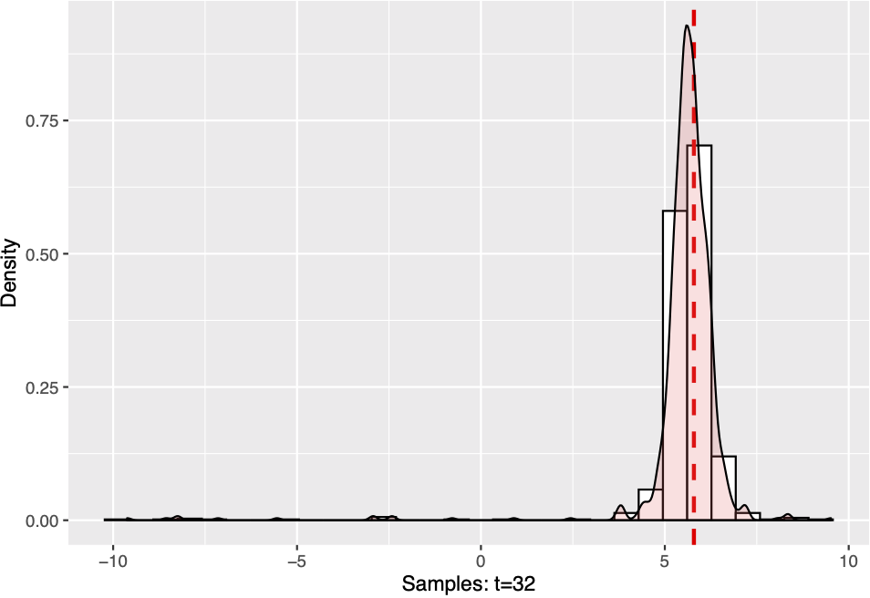
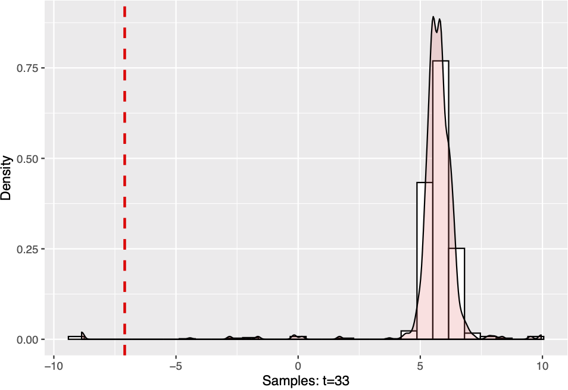
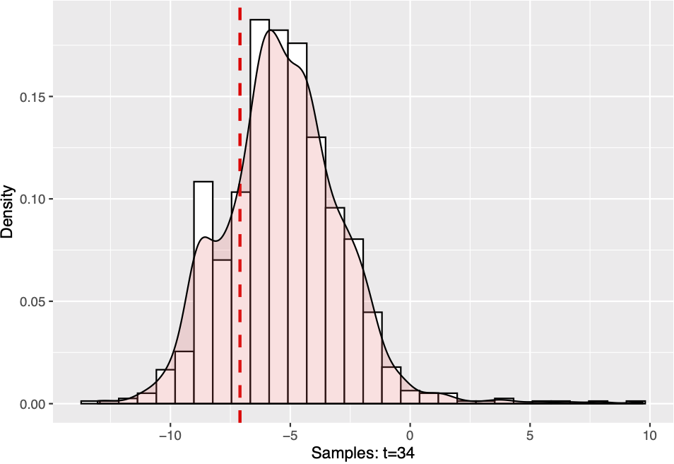
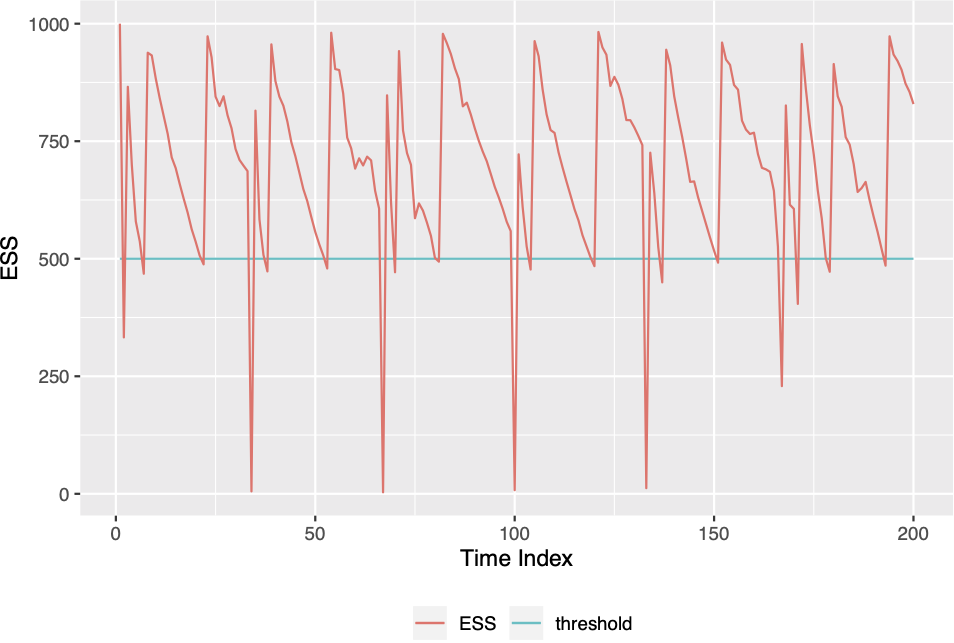
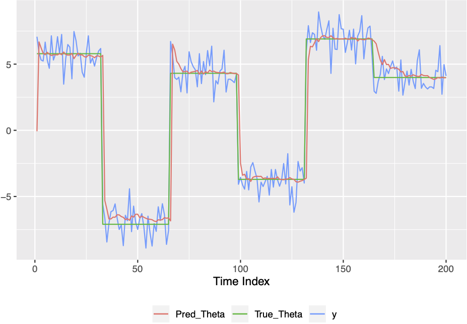

PFSMC - Package Documentation
================

<!-- README.md is generated from README.Rmd. Please edit that file -->

This documentation gives an illustration of how to use the `PFSMC` R
package to detect change points in data generating process based on an
update rule and sequential Monte-Carlo algorithm (see Ding, Zhou, and
Tarokh 2018). Our goal is to achieve an asymptotic oracle score instead
of false alarm or location accuracy. In this package, we focus on
dealing with online data that comes sequentially with abrupt changes in
their underlying distribution. We will first introduce the motivation of
developing the underlying algorithms and illustrate how the prediction
process works. Then we will show how to install the package from github
and do related simulations. At last we will demonstrate several examples
using the embeded functions.

# Introduction

Large datasets may vary in their underlying data generating process,
that is what we define as changepoints. Changepoint detection is the
task of detecting those changes according to observed datasets. Roughly
we can categorize detection method into two branches: online detection
and offline detection. Difference comes from the way data are observed.
Our package is basded on online method, where data comes sequentiall and
we detect changepoints as soon as they occur in a real-time setting.

There are also different kinds of change points, which can be divided
into abrupt changes and smooth changes. Abrupt changes refer to sharp
change in underlying models, while smooth changes refer to slowly
changed densities. When changepoints occur as a function of time, that
is, when data have time-varying underlying densities, traditional online
or offline methods may be less effective to be applied. That motivate us
to figure out a more efficient
solution.


# Problems Solution: Prediction Rule

To solve this problem, we implement a concept of
“-net”, which is applicable both for parametric models and
non-parametric models. We choose an appropriate
-net for the model class
 and obtain
 function bases
},...,g_N^{(\\epsilon)}\\}"). We first assign each
samples equal weights of
. When receiving new observations, we update the weights
according to a score function. That requires us to find an appropriate
metric to evaluate the detection method’s performance. Here, we utilize
a score function which relates to the observations. We predict the
density of parameter flow at time t based on the observations of
 and denote the predicted density at time t as
. We then specify a scoring function
 where
 is the model class of
 and
 is the range of
. A common
practice is to use the logarithmic scoring rule =-\\log g(y)") which is a strictly proper scoring (see Bickel
2010). That is, for any predicted density
, g^*(y)\\geq s(g^*,y)g^*(y)") and the equation
is satisfied only when
.

## Scoring Rule

For Gaussian data, the logarithm scoring function
") is equal to
^2/2"). We create `loss` function to realize the score
function where `theta` denotes samples and `y` is the data point.

``` r
loss=function(theta,y) {
  return((theta-y)^2/2)
}
```

## Parametric Model Class

When problems are restricted within parameter model class, we can extend
the prediction rule to parameter space. When
 is limited to infinity, we can get continuous sample space.

We first clarify some notations for parameter space. Denote
 as the Lebesgue measure for parameter space
.
In particular, each
 is a one-dimensional closed interval with the maximum value
 as upper bound and the minimum value
 as lower bound. Taken together, we
get
") and


We add learning parameter
 and use
the exponential loss \\}") to estimate the predictive
distribution distribution
").

Then we begin to set up the algorithm with continuous parameter space.
We add the learning parameter
 to assign
weights of next time step samples. After observing new data
 we obtain that
=f_{t-1}(\\theta)\\cdot \\exp\\{-\\eta s(\\theta,y_t)\\}").
We dervive the `exploss` function, since now what we want to calculate
is the exponential loss. Same as before, `theta` is the parameter flow
and `y` is the corresponding data sequence.

``` r
exploss = function(theta,y,mode=1,eta=1) {
  #mode = 1: first specify loss function then exp it
  #mode = 0: directly calculate the "likelihood"
  if(mode==1) {
    el=exp(-eta*loss(theta,y));
    } else {
      el=dnorm(y,theta,1);
  }
  return(el)
}
```

The weighted elements will better track abrupt changes since
neighborhood elements gain similar scores. Here we use the logarithmic
scoring rule that is mentioned above. Mixing parameter
 is
added to mix the updated samples and the normalizing constants
. The
form is derived as
\\tilde{g}_t(\\theta)+\\alpha\\frac{\\int_{\\Theta} \\tilde{g}_t(\\tilde{\\theta})d\\tilde{\\theta}}{|\\Theta|}").
We integrate the form into the `transition` function, where `theta`
denotes the samples and `alpha` is a given mixing rate.

``` r
transition=function(theta,alpha) {
  n=length(theta) 
  u=runif(n)
  u=as.numeric(u<=(1-alpha))
  theta_new=theta*u+(a+(b-a)*runif(n))*(1-u)
  return(theta_new)
}
```

Learning parameter  and mixing parameter
 give
a “tempering” effect on the weight updating, offering more
tolerance/flexibility for potential underlying changes, while producing
different rates of convergence. In the mixing step, we redistribute the
belief for the values of parameters, which also make it more quickly to
detect
changes.

<!-- After drawing samples from a Markov kernel, we start to move them according to the transition kernel $K(\cdot|\theta^i_{t+1})\triangleq(1-\alpha)\delta(\cdot)+\alpha/|\Theta|$ specified in step 11 of algorithm 1. With probability $1-\alpha$, let $\theta^i_{t+1}=\theta^i_{t+1}$; with probability $\alpha$, let $\theta^i_{t+1}\sim\text{Unif}(\Theta)$ for $i\in\{1,...,N\}$. `alpha` is our chosen mixing parameter, given by $\alpha_{\text{optimal}=\frac{M_T-1}{T-1}}$.   -->

# Sequetial Monte Carlo Implemented

When calculating the predictive distribution, we use integral to
estimate the predictive parameter instead of discretizing model space.
That increases the computational cost and has some difficulty in
parctical applicaiton. This brings us about using Monte Carlo methods to
better sampling from the predicted distributions (see Brooks et al.
2011). We see the mixing process as a state space trasition and use an
MCMC kernel to move the particles.

The metric can be simplified as three steps:

1.  Update the weights based on exp)");
2.  Resample the particles according to their weights;
3.  Move the particles using the transition kernel
    ").

`Step 1` assigns different weights to the generated samples from an
appropriate proposal distribution, while the weights can correct the
sample in order to approximate the predictive distribution. `Step 2`
turns weighted particles to unweighted ones and make highly weighted
samples more easily to be selected. `Step 3` creates a Markov chain
_{t\\geq1}") with a MCMC kernel aiming to improve the
diversity among the samples. We will first introduce the applied
algorithms and then illustrate in the pseudo
code.

## Metropolis-Hastings algorithm

<!-- Metropolis-Hasting type is used to generate a Markov Chain $(\Theta_t)_{t\geq1}$ with a transition kernel $K$. At each time t, a candidate $\Theta^*$ is accepted as the new state of the chain with probability $\alpha$ or the chain stays at the last state $\Theta^{t-1}$. The moving step increases samples diversity by changing their locations which helps a lot in converging rates when change occurs. -->

Consider a setting that
") in the mixing step can be point-wise evaluated. A
popular approach is to generate a Markov chain
to approximate the integral
"). In some sense,   
![\\int\_\\Theta
\\tilde{g}\_t(\\bar{\\theta})K(\\theta|\\bar{\\theta})d\\bar{\\theta}\\xrightarrow
\[T\\rightarrow\\infty\]{}
(1-\\alpha)\\tilde{g}\_t(\\theta)+\\alpha\\frac{\\int\_{\\Theta}
\\tilde{g}\_t(\\tilde{\\theta})d\\tilde{\\theta}}{|\\Theta|}](https://latex.codecogs.com/png.latex?%5Cint_%5CTheta%20%5Ctilde%7Bg%7D_t%28%5Cbar%7B%5Ctheta%7D%29K%28%5Ctheta%7C%5Cbar%7B%5Ctheta%7D%29d%5Cbar%7B%5Ctheta%7D%5Cxrightarrow%20%5BT%5Crightarrow%5Cinfty%5D%7B%7D%20%281-%5Calpha%29%5Ctilde%7Bg%7D_t%28%5Ctheta%29%2B%5Calpha%5Cfrac%7B%5Cint_%7B%5CTheta%7D%20%5Ctilde%7Bg%7D_t%28%5Ctilde%7B%5Ctheta%7D%29d%5Ctilde%7B%5Ctheta%7D%7D%7B%7C%5CTheta%7C%7D
"\\int_\\Theta \\tilde{g}_t(\\bar{\\theta})K(\\theta|\\bar{\\theta})d\\bar{\\theta}\\xrightarrow [T\\rightarrow\\infty]{} (1-\\alpha)\\tilde{g}_t(\\theta)+\\alpha\\frac{\\int_{\\Theta} \\tilde{g}_t(\\tilde{\\theta})d\\tilde{\\theta}}{|\\Theta|}")  
, where
") is an MCMC kernel. In purpose of generating
a Markov chain, we can use Metropolis-Hastings algorithm.

We denote by  a proposal
distribution on  which we will go into detail in *Sequential Monte Carlo for
Kinetic Prediction* section. We first sample
 from
"). With some probability
 the
samples move to
, otherwise they just stay at current state. The algorithm
is shown as follows.

-----

Starting from an arbitrary
, iterate for


1.  Sample "), where q is a
    proposal distribution.

2.  Compute
      
    =\\min\\left(1,\\frac{\\pi(\\Theta^*)q(\\Theta^{t-1}|\\Theta^*)}{\\pi(\\Theta^{t-1})q(\\Theta^*|\\Theta^{t-1})}\\right).")  

3.  With probability
    "), set
    ; otherwise
    .

-----

We use the `MH_move` function to generate the Markov Chain mentioned. We
choose
") as our
proposal distribution where
 is the sample mean and
") is the sample variance from previously retrieved
unweighted samples. We denote the parameters as `prop_mean` and
`prop_sig`. We set `theta` as current samples and `targrtdist` as the
approximated result from preceding filtering distribution. Finally, we
get the required Markov Chain `theta_new` from `MH_move`.

``` r
MH_move=function(theta,targetdist,prop_mean,prop_sig) {
  siz=length(theta)
  theta_new=rnorm(siz,prop_mean,prop_sig) #Generate samples from proposal distribution
  a1=targetdist(theta_new)/targetdist(theta) 
  a2=dnorm(theta,prop_mean,prop_sig)/dnorm(theta_new,prop_mean,prop_sig)
  a=a2*a1 
  #Accept the new candidate with probability min(1,a); otherwise just stay at the previous state.
  accept=rep(0,length(a)) 
  for (i in 1:length(a)) {
    accept[i]=min(1,a[i]) #alpha = min(1,a)
  }
  u=runif(siz) #The probability of accepting the new candidate
  u=as.numeric(u<accept)
  theta_new=theta_new*u+theta*(1-u)
  return(theta_new) #Return the Markov chain.
}
```

## Multinomial Resampling

To prevent the samples to be too concentrated, we add a resampling step
after updating the weights. Significant samples gain larger weights and
thus have more chance to be selected. Samples degeneracy results from
this step can be shown in the Effective Sample Size. ESS was derived
from the estimators’ variance and can be simplified as
^2}") with
 as sample
weight. ESS drops rapidly as observations arrive in algorithm 1. We can
solve the issue by resampling tricks when ESS falls below a threshold. A
common practice is using multinomial resampling, which will be displayed
next. We choose multinomial resampling algorithm to draw unweighted
sample
 out of the weighted sample
_{i=1}^N") to approximate the target distribution. The
resampling process is described in the following algorithm.

-----

1.  Draw an “ancestry vector”  independently from a categorical
    distribution:   
    =W^k ")  
2.  Define
     to be
     for all
    .
3.  Return
    .

-----

Each sample
 is an ancestor of several offspring which is proportional
to the sample weight . This is exactly the rule of multinomial distribution:
"). Sample
with higher weight tends to appear more frequently in the unweighted
sample set. We realize the algorithm through `resampleMultinomial`
function. It inputs samples’ weights `weight` and returns the index of
samples that are selected. We replace the original samples with selected
samples.

``` r
resampleMultinomial=function(weight) {
  M=length(weight) 
  Q=cumsum(weight)
  Q[M]=1
  indx=rep(0,M) #store sample index
  i=1
  while (i<=M) { 
    sampl=runif(1)
    j=1;
  #Resample according to sample weights
  while(Q[j]<sampl) {
    j=j+1
    }
  indx[i]=j
  i=i+1
  } 
  return(indx)
}
```

## Sequential Monte Carlo Particle Filter

Based on the four algorithms above, we come up with the sequential Monte
Carlo sampler for kinetic prediction as data comes sequentially(see
Ding, Zhou, and Tarokh 2018). To initialize, we sample from a uniform
distribution with a compact parameter space
 and
use equal weights as
.
After observing newly comes observation, we update the weights based on
Bayesian rule using a logarithm score and transform them to a normalized
format. Step 5 computes some useful constants which will be explained
later. Step 8-12 is the
 step. We first compute the effective sample
size which is inverse of the sum of squared weights. When ESS is smaller
then a give threshold, generally half of the sample size, we start our
 process. In step 9, we use multinomial
distribution to obtain equally weighted samples and then use MH type to
move samples according to an MCMC kernel. At last, we mix those
resampled samples with a transition kernel  \\triangleq(1-\\alpha)\\delta(\\cdot)+\\frac{\\alpha}{|\\Theta|}")
to gain more sample diversity.

-----

Input: Compact parameter space
, data
 observed sequentially, learning parameter
,
mixing parameter
"), number of particles
, and ESS thershold
![c\\in\[0,1\]](https://latex.codecogs.com/png.latex?c%5Cin%5B0%2C1%5D
"c\\in[0,1]").

1.  Initialization: sample
     independently from
    Unif"), and let
    , for all
    .

for  do

2.  Use the weighted samples
    _{i=1}^N") to approximate the predictive
    distribution
    ");

`Update the Weights:`

3.  After receiving new observation
    , calculate
    given score function
    ");

4.  Update weight \\}");

5.  Calculate
    ,
    , which will be
    used in the rejuvenate step;

6.  Normalize . Note that
    _{i=1}^N") approximates the density
    }{\\int_{\\Theta}\\tilde{f}_t ({\\tilde{\\theta}})d\\tilde{\\theta}}");

`Resample when ESS falling too low:`

7.  Calculate
    ^2}");

if 
do

8.  Resample
    _{i=1}^N") to obtain equally weighted
    samples
    _{i=1}^N");

`Rejuvenate/Move:`

9.  Draw ") using
    Metropolis-Hastings algorithm, where
     is an MCMC
    kernel targeting at the density
    }{\\int_{\\Theta}\\tilde{f}_t ({\\tilde{\\theta}})d\\tilde{\\theta}}").

else

10. ,
    ;

end if

11. Move
     according to the transition kernel
     \\triangleq(1-\\alpha)\\delta(\\cdot)+\\frac{\\alpha}{|\\Theta|}");

end for

-----

# R Implementation

Based on existing codes, we wrap up an R package for usage convenince.
We can install the package from Github through a single line of code.

``` r
devtools::install_github("azure10h/PFSMC")
library(PFSMC)
```

## Function Call Graph

We have demonstrated some internal functions in previous sections. Now
we display a function call graph of `PFSMC`. Left plot shows how the
functions call each other and right plot shows the input and output of
each
function.


## Implementation of PFSMC function

In `PFSMC` package, we have two functions: `PFSMC` and
`resampleMultinomial`. `PFSMC` is an implementation of the Sequential
Monte Carlo Partical Filter and `resampleMultinomial` is a resampling
method that turns weighted samples to unweighted samples.

We start with initializing samples and weights to realize our algorithm.
We sample ") and compute the weights
 for
. Here, the uniform distribution is a proposal
distribution which is easy to sample from. We specify time index `T` as
201 and particle numbers `N` as
1000.

``` r
a=-10;b=10;N=1000;T=200 #Setting parameter space as (-10,10); particle numners N=1000; time=200
tha_sample=-a+(b-a)*runif(1000) #Initial particles theta_1^i for i=1:N
weight=matrix(0,T,N) #Store weights at each time
weight[1,]=rep(1,N)/N #Initial weights W_1^i=1/N
```

In the mixing step, one hard task is to calculate the integral of the
targeting distribution
"). It is proved that we can estimate the integral
as a normalizing constant
 in step 5. That is,
").
Effective sample size is a criterion to decide the trigger of resampling
process while `resample` is a flag of resampling. When `ESS` falling too
low, we need to construct unweighted samples. We also create `theta_hat`
to store our future predicted parameters for evaluating the predictive
metric.

``` r
Z=rep(0,T) #Normalizing constants denoted in step 5
Z[1]=1 #Sum of weights is equal to 1 with equal weights
ESS=rep(0,T) #Store effctive sample sizes
ESS[1]=N #Initial effective sample size N
resample=numeric(T) #Store resample flags
theta_hat=numeric(T) #Store predicted parameters
```

### Generating the True Parameters and Data Sequence

We create a function called `datagenNoml` to create the true parameters
and data sequence where `T` is the time series, `k` is the number of
abrupt changes, `a` and `b` are the parameter space. We first generate a
parmeter flow with `k` abrupt changes and then sample data points from
the normal distribution with changing means and unit variance, that is,
")

``` r
datagenNoml = function(T,k,a,b,sig=1) { 
  if(k==0) {
    theta_true=(a+(b-a)*runif(1))*rep(1,T)
    Y=rnorm(T,theta_true,sig*rep(1,T))
  }
  #determine the chage point randomly
  change_point=floor(T/(k+1))*c(1:k)
  change_point=c(1,change_point,T)
  theta_list=a+(b-a)*runif(k+1)
  theta_true=rep(0,T)
  #Generate the true parameter
  for(j in 1:(k+1)) {
    theta_true[change_point[j]:change_point[j+1]]=theta_list[j]
  }
  #Generate data
  Y=rnorm(T,theta_true,sig*rep(1,T))
  return(list(Y,theta_true))
}
```

In this case, we choose
,
,
 and
. We run the
function and get the normal data sequence as the plot displays. The red
straight line is the true mean and the light blue line is the data
sequence.


Now we start to use the function `PFSMC` to detect change points. We use
previously generated normal data sequence Y as `Y`. We then specify
learning parameter `eta` as 0.1, particle numbers `N` as 1000, ESS
threshold `c` as 0.5, time index `T` as 200. For mixing parameter
`alpha`, we choose the value `(k-1)/(T-1)` which equals to 0.025.

``` r
library(PFSMC)
set.seed(0421)
a=-10;b=10 #Parameter space
Data=datagenNoml(T,k,a,b) 
Y=Data[[1]] #Data sequence
theta_true=Data[[2]] #True theta
Simulation<-PFSMC(Y=Y,eta=0.1,alpha=0.025,N=1000,c=0.5,T) 
samples=Simulation$samples #Predictive distributions
```



We plot the predictive distribution around time `T=33` which is a change
point. The model has an excellent ability to detect change and samples
move quickly when change occurs.

### Effecitve Sample Size

``` r
ESS=Simulation[[1]] #Output: efective sample sizes.
Z=Simulation[[2]] #Output: normalizing constants.
theta_hat=Simulation[[3]] #Output: predictive parameters.
resampleflags=Simulation[[4]] #Output: resample flags.
plot(ESS,type = 'l',main = 'ESS',xlab = 'Time Index t')
abline(h=500,col='red',lwd=2)
```



From the ESS plot we can see that once the effective sample size falls
below the threshold , the resampling and move step is triggered immediately to
increase it.

### Predictive Mean

``` r
plot(Y,type = "l",col="lightblue",axes=F,ylab="",xlab="")
par(new=T)
plot(data.frame(x=1:201,y=theta_true),type='l',col='red',ylim=c(a,b),
     ylab='Data sequence/True mean/Predictive mean',xlab='time index')
title(main="Normal Data Sequence")
par(new=T)
plot(data.frame(x=1:201,y=theta_hat),type='l',col='blue',ylim=c(a,b),
     ylab='',xlab='',axes=F)
ws=numeric(201)
for (i in 1:201){ws[i]=Simulation$samples[i,]%*%Simulation$weight[i,]}
par(new=T)
plot(data.frame(x=1:201,y=ws),type='l',col='green',
     ylim=c(-10,10),ylab='',xlab='',axes=F)
legend("bottomright",legend = c("Data","True mean","Predictive mean","Weighted mean"),lty=c(1,1,1),
       col=c("lightblue","blue","red","green"),cex = 0.5)
```


Here we use the mean of the samples as predictive mean. It is shown that
the model is good fitted and sensitive to changes. We also compute the
weighted mean as an alternative. The second plot displays that most part
of these two means are overlapped and there is no much difference
between them.

# Reference

<div id="refs" class="references">

<div id="ref-bickel2010scoring">

Bickel, J Eric. 2010. “Scoring Rules and Decision Analysis Education.”
*Decision Analysis* 7 (4). INFORMS: 346–57.

</div>

<div id="ref-brooks2011handbook">

Brooks, Steve, Andrew Gelman, Galin Jones, and Xiao-Li Meng. 2011.
*Handbook of Markov Chain Monte Carlo*. CRC press.

</div>

<div id="ref-ding2018asymptotically">

Ding, Jie, Jiawei Zhou, and Vahid Tarokh. 2018. “Asymptotically Optimal
Prediction for Time-Varying Data Generating Processes.” *IEEE
Transactions on Information Theory* 65 (5). IEEE: 3034–67.

</div>

</div>
